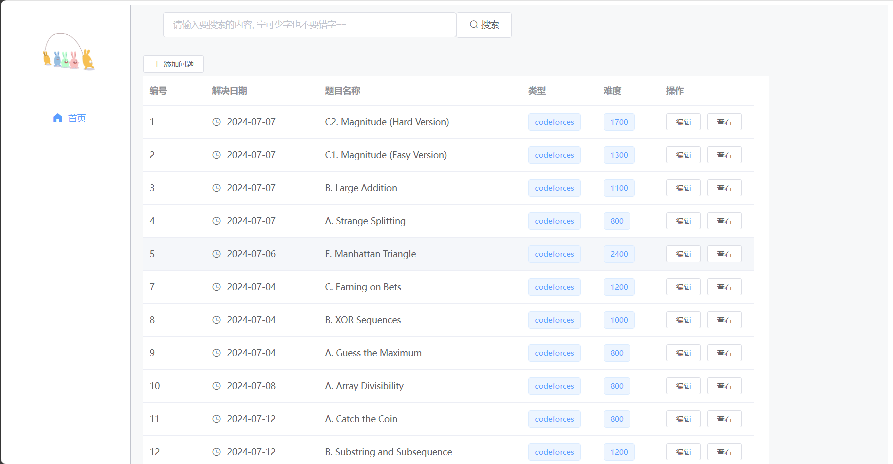
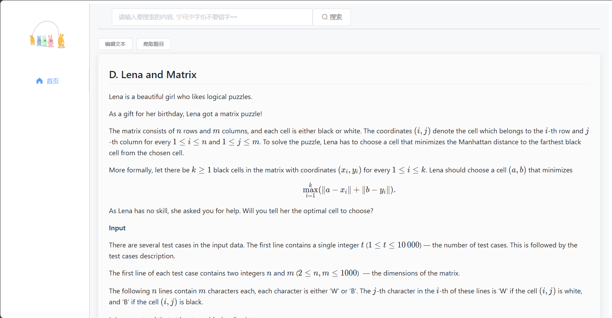
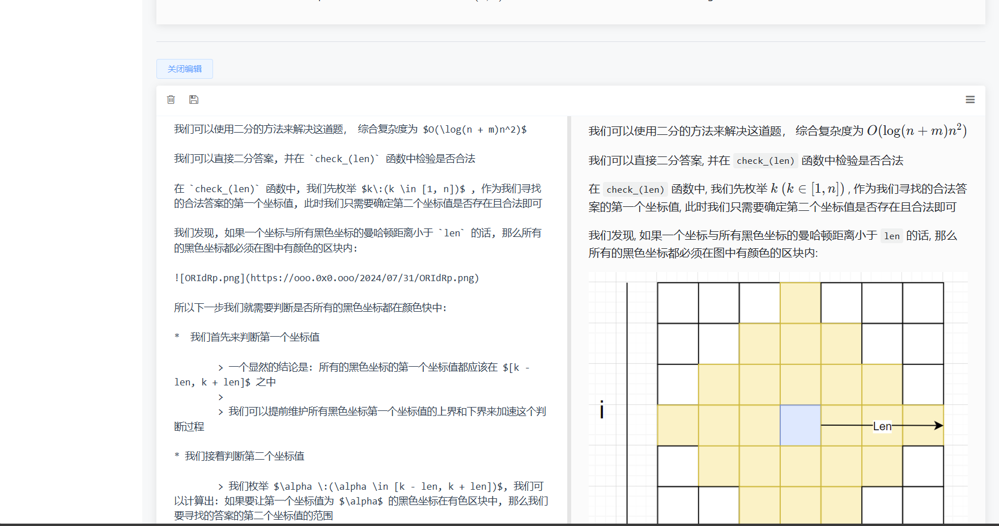

# ACM_REPORT: 辅助刷题系统

本项目前端使用 `Vue` 实现, 后端使用 `Go` 实现, 主要功能是为 IO 选手或者 XCPC 选手自己统计自己每一天的做题量以及题解

题目使用 MarkDown 书写并在渲染后展示, 题目支持自动通过爬虫获取（现阶段只支持 `Codeforces`）

项目仍然在开发中...持续完善

主要页面展示如下:

**主页面**

**题目展示**

**题解展示和编辑**

